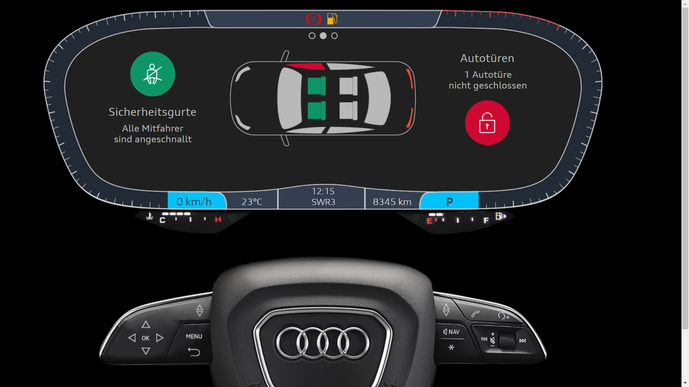
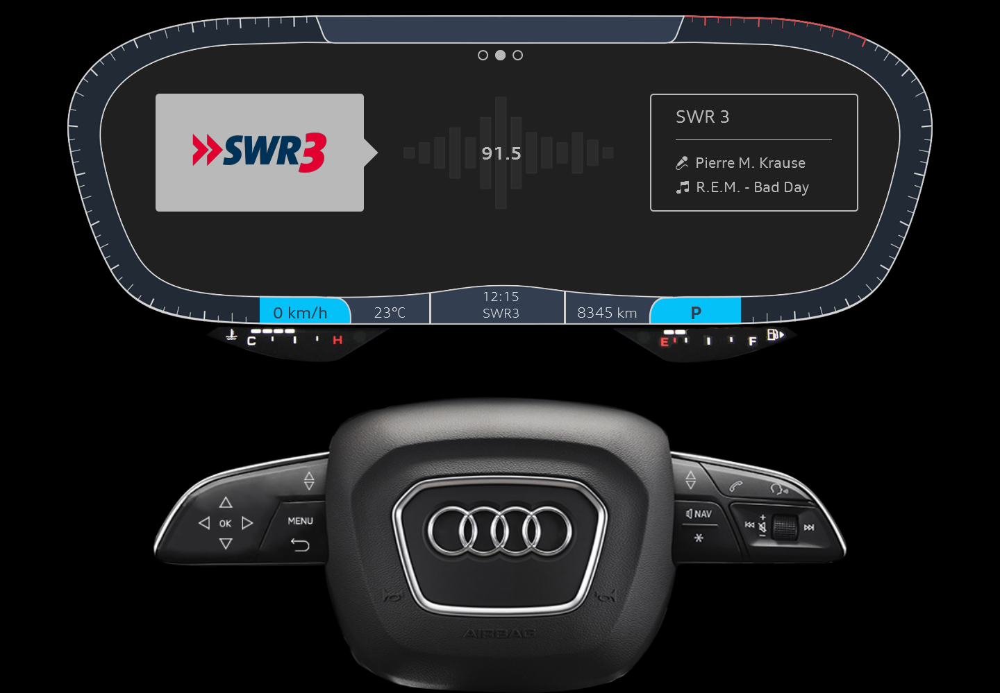
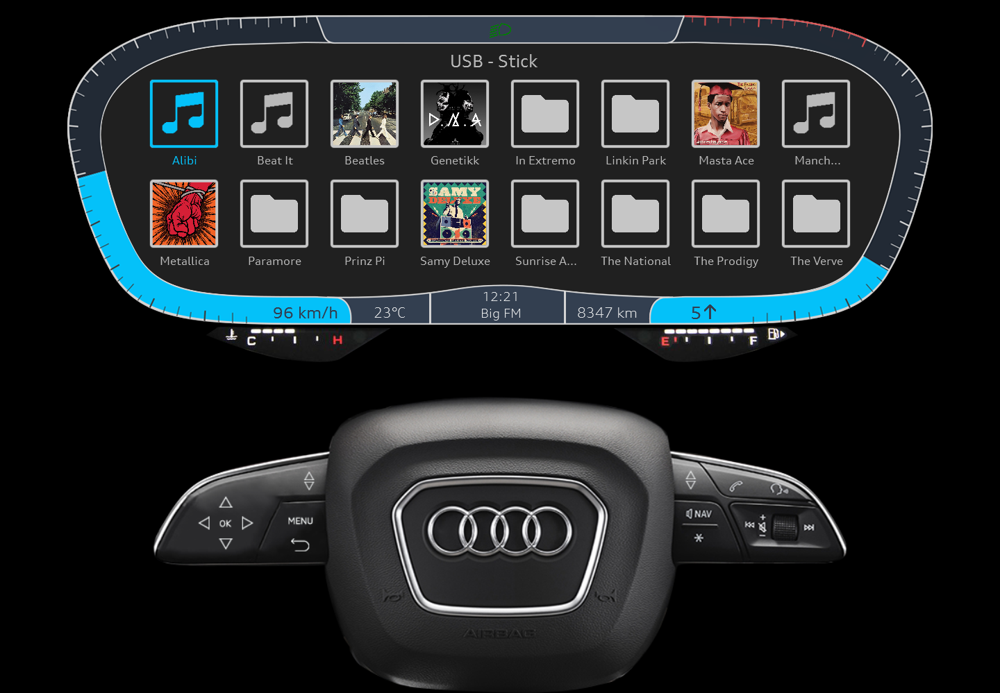
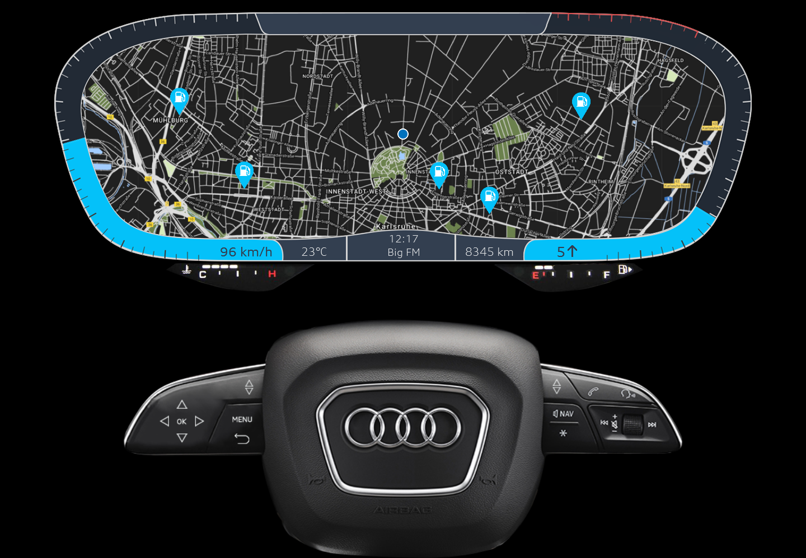
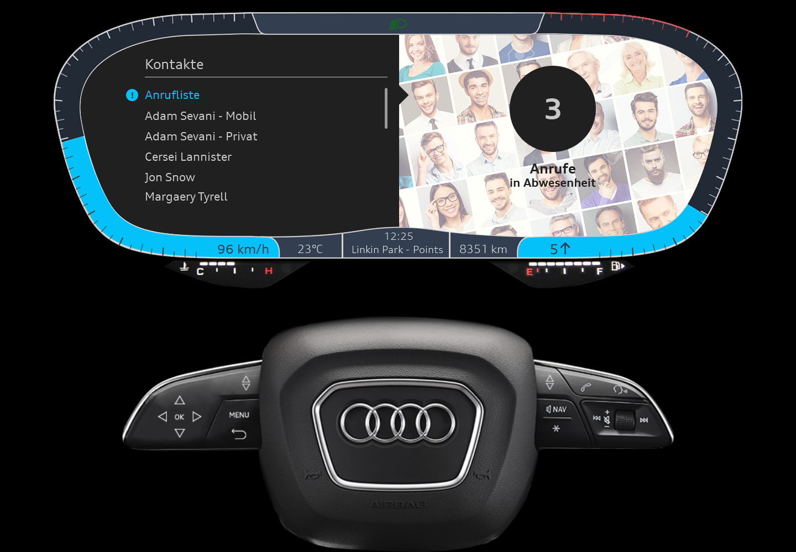

# VirtualAudiCockpit
Verbesserung des Audi Virtual Cockpit User Interfaces 
Dieses Projekt wurde im Rahmen meines Bachelor Studiums (in 2017) als Projektarbeit realisiert. Bei der Bearbeitung waren verschiedene Studierende beteiligt. 
_____________________________________
<b>Tech:</b> 
Adobe Illustrator/Photoshop, Axure RP
_____________________________________
<b>Meine Aufgaben:</b> 
- Erstellung und Bearbeitung von Grafiken
- Erstellung eines Prototypes in Axure RP

<b>Hauptansicht: Sicherheitsgurt & Türenkontrolle</b> 

 

<b>Musikansicht: Radio</b> 

 

<b>Musikansicht: USB-Stick</b> 

 

<b>Navigationsansicht: Tankstellen in der Nähe</b> 

 

<b>Telefonansicht: Kontakte</b> 

