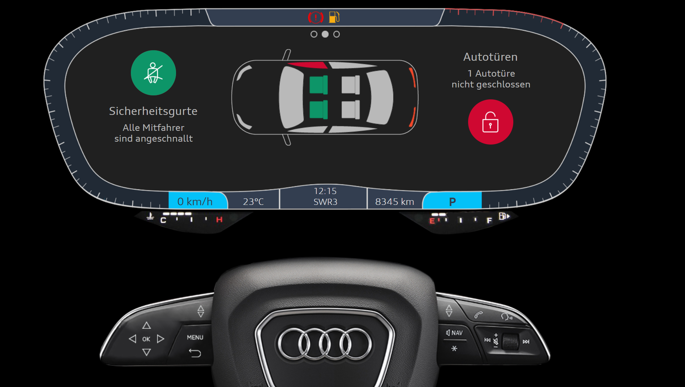
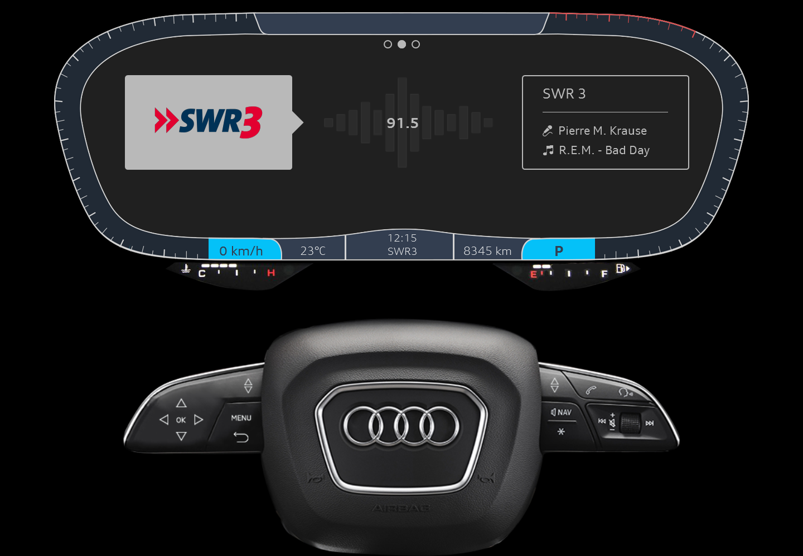
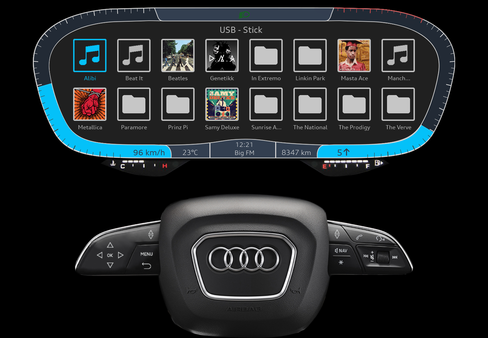
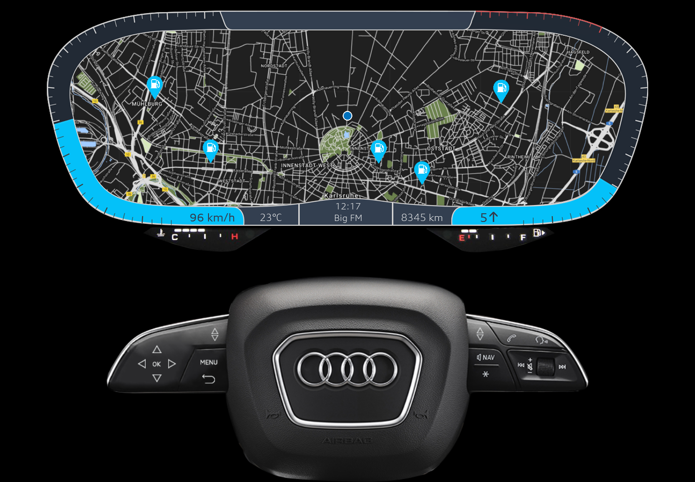
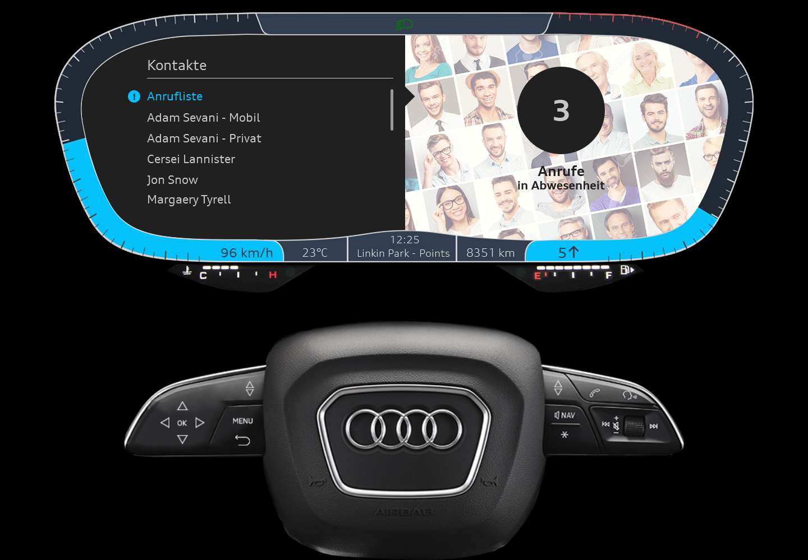
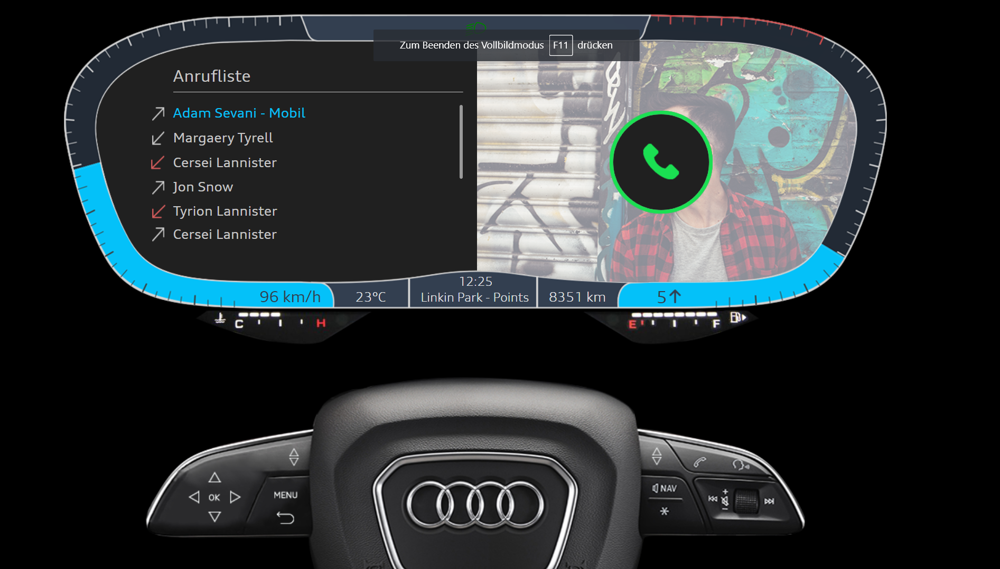

# Virtual Audi Cockpit

UI concept for improving the Virtual Audi Cockpit user interface.

This project was developed in 2017 during my Bachelor's studies as a collaborative project with several other students.

## 🛠 Tech Stack
Adobe Illustrator & Photoshop, Axure RP

## My Tasks
- Creating and editing graphics
- Designing and implementing an interactive prototype in Axure RP

## 📸 Showcase
<b>Main View - Seat Belt & Door Status</b> 

 

<b>Music View - Radio</b> 

 

<b>Music View - USB Drive</b> 

 

<b>Navigation View - Nearby Gas Stations</b> 

 

<b>Phone View - Contacts</b> 

<b>Phone View - Call History</b> 

